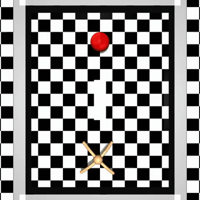
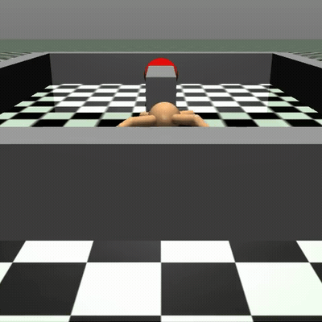
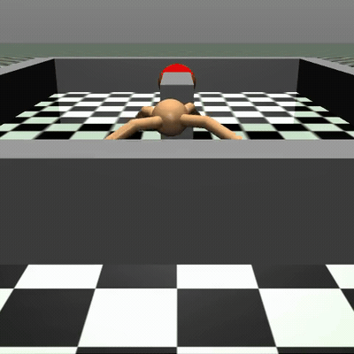
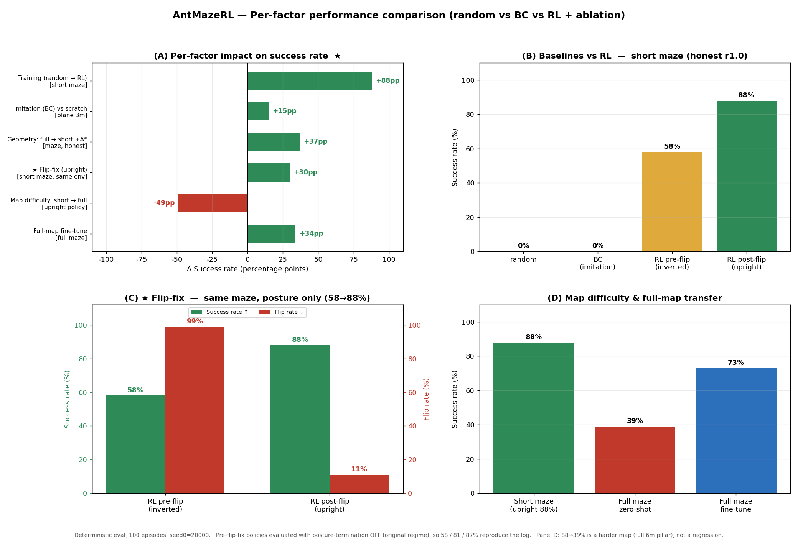
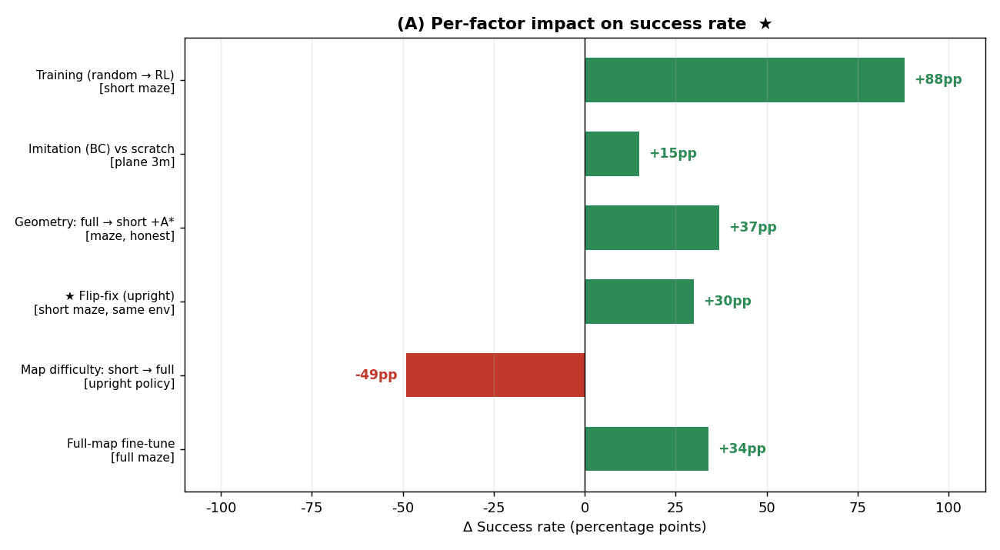

# AntMazeRL 🐜

A reinforcement learning project that trains a MuJoCo Ant robot to traverse a maze
**quickly, energy-efficiently, and without bumping into walls.**

<p align="center">
  
</p>

*The trained policy solving the shrunk-pillar maze · **88%**, viewed top-down — classic **A\*** plans the waypoints, **RL** walks between them. Below: the bug that got it there.*

<table><tr>
  <td align="center"><b>Before — crawling inverted · 58%</b></td>
  <td align="center"><b>After — upright walk · 88%</b></td>
</tr><tr>
  <td></td>
  <td></td>
</tr></table>

*Same maze, same A\* path — only the posture was fixed, and the same environment went **58% → 88%**. The bug was found by watching the rollout videos: the ant was succeeding while **crawling upside-down**.*

## 📊 Results

The game-changer was spotting — in the rendered videos — that the ant was **crawling
upside-down** and fixing it. Maze success rate went **8% → 88%** (short maze, same
environment, posture corrected only), and **73%** even on the true full maze (clearing
the 70% gate that was previously considered out of reach).



How much each intervention (factor) raised performance — measured by **holding the
environment fixed and changing one variable at a time** (deterministic, 100 episodes, seed0=20000):

| Factor (intervention) | Controlled env | Δ Success |
|---|---|---|
| Training (random → RL) | short maze | **+88pp** |
| Imitation (BC) vs scratch | plane 3m | **+15pp** (scratch wins) |
| Geometry: full → short pillar +A* | maze | **+37pp** |
| ★ **Flip-fix (upright posture)** | short maze (**same env**) | **+30pp** (58→88) |
| Map difficulty: short → full | upright policy | **−49pp** (harder map) |
| Full-map fine-tune | full maze | **+34pp** (39→73) |



- Full tuning log: **[EXPERIMENTS.md](EXPERIMENTS.md)** · Full result videos (in experiment order): **[outputs/videos/](outputs/videos/)** · Reproduce the evaluation: `python -m scripts.evaluate_comparison && python -m scripts.plot_comparison`
- The before/after clips above are the flip fix on the **same** short maze (posture corrected only); the full-maze 73% run is under [outputs/videos/](outputs/videos/).

## Pipeline
1. **Environment** — custom maze + reward function (speed + energy + collision avoidance)
2. **Imitation Learning (BC)** — clone a scripted expert to obtain an initial policy
3. **Reinforcement Learning (PPO)** — improve the policy through trial and error
4. **World Model** — a transformer that predicts future states
5. **Evaluation & Documentation** ✅ — random vs BC vs RL + per-factor ablation (`scripts/evaluate_comparison.py` → `outputs/evaluation_results.json`, `scripts/plot_comparison.py` → `outputs/images/comparison.png`)
6. **Compression** — quantization for faster inference (toward edge deployment)

## Tech stack
Python 3.12 · MuJoCo · Gymnasium · PyTorch · Stable-Baselines3 · W&B

> The maze environment is built from scratch (it does **not** use gymnasium-robotics' AntMaze) — to demonstrate environment-design skills.

## Structure

> **AI agents / Claude Code:** start at [`CLAUDE.md`](CLAUDE.md) — the always-loaded index that points to per-folder `CLAUDE.md` guardrails and `docs/context/`, so you read distilled context instead of re-reading the source.

```
src/        # core code (environment, models, training logic)
configs/    # YAML configs (hyperparameters, etc.)
data/       # datasets (demonstrations, rollouts, etc.)
models/     # trained checkpoints (only the key ppo_final.zip are tracked — retrain the rest via configs)
notebooks/  # Jupyter notebooks for analysis
scripts/    # entry-point scripts (training, evaluation, testing)
outputs/    # artifacts (figures, videos, JSON; raw logs in outputs/logs/ are excluded)
```

> Only the **final checkpoints** are committed (size). All intermediate checkpoints, W&B logs, and expert demonstrations are excluded — everything is reproducible via `configs/`.

## Setup & run
```bash
python3.12 -m venv venv
source venv/bin/activate          # Windows: venv\Scripts\activate
pip install --upgrade pip
pip install -r requirements.txt
python -m scripts.check_install   # verify the env works (obs includes x,y + saves the first frame)
```

## Troubleshooting
- **Black screen when rendering**: change `MUJOCO_GL` in `scripts/check_install.py` from `"glfw"` to `"egl"` or `"osmesa"`.
- **`pillow`/`numpy` build failure**: your Python may be too new (e.g. 3.14) with no prebuilt wheels → recreate the venv with **Python 3.12** (`rm -rf venv && python3.12 -m venv venv`).
- **`Ant-v5` not found**: gymnasium is outdated → `pip install -U "gymnasium[mujoco]"`.
